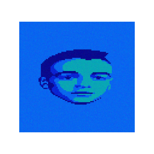

# Acid Warp for Linux

## Snap

- 
- Supports devices running Ubuntu 24+ and OpenGL 4.1+.
- SDL3 is statically linked (for now) as latest Ubuntu LTS (24.04) [does not include SDL3](https://launchpad.net/ubuntu/+source/libsdl3).

## Technical Details
- Based on a [fork](https://github.com/Dermochelys/acidwarp) of [dreamlayers/acidwarp](https://github.com/dreamlayers/acidwarp), which is embedded as a [submodule](acidwarp).
- See the submodule's [README.md](https://github.com/Dermochelys/acidwarp) for more details.

## Building Locally

### Dependencies
- See [CMakeLists.txt](CMakeLists.txt) for dependency information.

### Build steps
- Build the app with Cmake by running `cmake --fresh && cmake --build .`

## Previous ports
- See the `previous_ports` folder inside the [submodule](https://github.com/Dermochelys/acidwarp).
- Original website: https://noah.org/acidwarp/

## License

As this is a descendent of Steven Will's `AcidWarp for Linux` which was GPL licensed, this too
is and must also be GPL licensed.  See [gpl-3.0.md](gpl-3.0.md)

